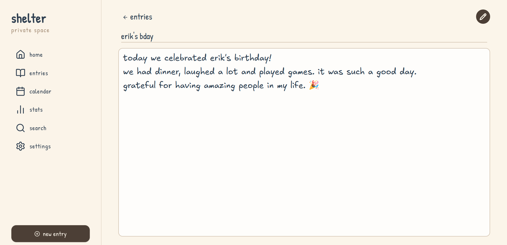

# Shelter - Web

A secure, open-source web-based journal designed with privacy and end-to-end encryption. Your data stays yours, stored directly in your browser.



Shelter is built with [Typescript](https://www.typescriptlang.org/), [Next.JS](https://nextjs.org/), [Tailwind](https://tailwindcss.com/), [Tiptap](https://tiptap.dev/), [Web Crypto](https://developer.mozilla.org/en-US/docs/Web/API/Web_Crypto_API) & ❤️.

## Features

- **Local-First Architecture:** Fast, resilient, and works entirely offline using IndexedDB.
- **End-to-End Encryption (E2EE):** Client-side encryption ensures nobody can read your entries.

## Getting Started

Follow these steps to set up the project locally for development.

### Prerequisites

- Make sure you have [Node.js](https://nodejs.org/) (20.9 or higher) installed.
- [pnpm](https://pnpm.io/es/) (recommended) or [npm](https://www.npmjs.com/).

### Installation

1. **Fork and clone the repository:**

```bash
git clone https://github.com/stageddat/shelter-web.git
cd shelter-web
```

2. **Install dependencies:**

```bash
pnpm install
```

3. **Run the development server:**

```bash
pnpm run dev
```

Open `localhost:3000` with your browser to see the result.

## Contributing

Contributions are welcome! Please read [CONTRIBUTING.md](./CONTRIBUTING.md) before submitting a pull request.

## 📄 License

This project is open-source and available under the [GNU AGPLv3](./LICENSE).