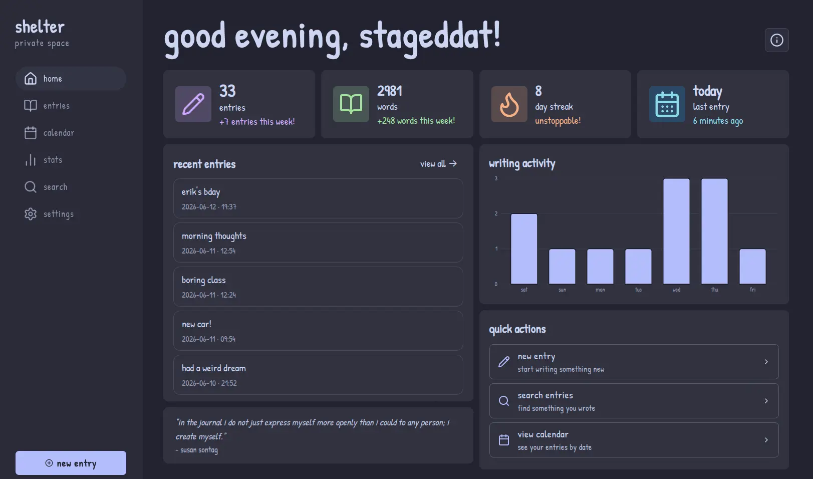
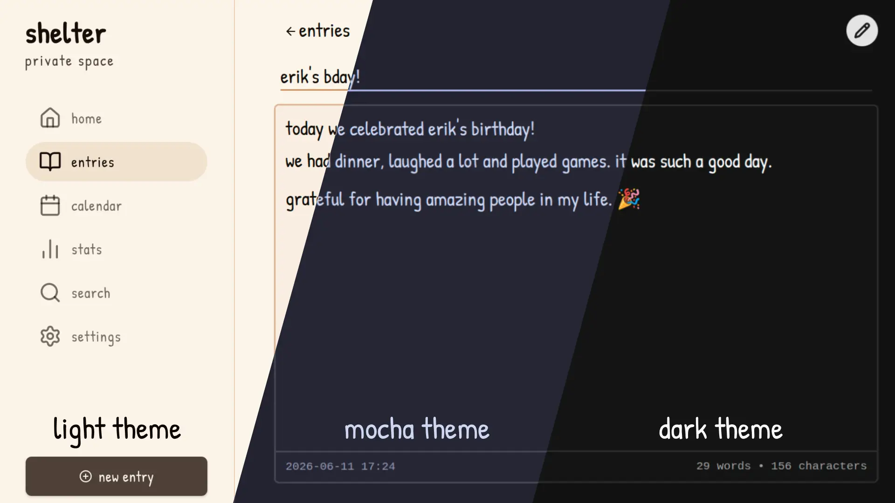

<div align="center">

# Shelter - Web
[**shelter.cat**](https://shelter.cat)<br/>
[Join our Discord server!](https://discord.gg/BntK5GbF2M)

</div>

Shelter is a cozy, secure and open-source web-based journal designed with privacy and end-to-end encryption. Your data stays yours, stored directly in your browser.

Built with [SvelteKit](https://svelte.dev/), [Web Crypto](https://developer.mozilla.org/en-US/docs/Web/API/Web_Crypto_API) & ❤️.

## Showcase gallery
Shelter web app home page:

Shelter editor with different themes built in:


<div align="center">

More screenshots in [SHOWCASE.md](./SHOWCASE.md)!

</div>

## Features

- **Local-First Architecture:** Works completely offline using IndexDB and Service Workers.
- **End-to-End Encryption (E2EE):** All sensitive information is encrypted on the client using Web Crypto. No one can read its contents, not even us.
- **Battle-tested encryption:** We implement robust and audited algorithms such as AES-GCM for encryption and PBKDF2 for key derivation.
- **No account required:** No email, no server, no tracking. Just open the app and start writing.
- **No Vendor Lock-in:** Your entries and notes belong to you. Export your entire library to standard open formats at any time (soon!).
- **Rich Text Editor:** Write with formatting using a clean, distraction-free editor powered by Tiptap.
- **Themes:** Choose the design you like best, from light and dark themes to community styles like Catppuccin, and many more on the way!
- **Multilingual:** Officially available in English and Catalan. Thanks to the community, we also have translations into Danish, Spanish, and many other languages!
- **Open Source:** Shelter is and always will be open source and free under the GNU AGPLv3 license.

## Getting Started

Follow these steps to set up the project locally for development.

### Prerequisites

- Make sure you have [Node.js](https://nodejs.org/) (20.9 or higher) installed.
- [pnpm](https://pnpm.io/es/).

### Installation

1. **Fork and clone the repository:**

```bash
git clone https://github.com/stageddat/shelter-web.git
cd shelter-web
```

2. **Install dependencies:**

```bash
pnpm install
```

3. **Run the development server:**

```bash
pnpm run dev
```

Open `localhost:5173` in your browser to view the local development server.

## Contributing

Contributions are welcome! Please read [CONTRIBUTING.md](./CONTRIBUTING.md) before submitting a pull request.

**Thank you to everyone who makes Shelter possible ❤️!**  
You can see the full list of people who have contributed to this project at [shelter.cat/credits](https://shelter.cat/credits).

<a href="https://github.com/stageddat/shelter-web/graphs/contributors">
  
</a>

## License

This project is open-source and available under the [GNU AGPLv3](./LICENSE).
